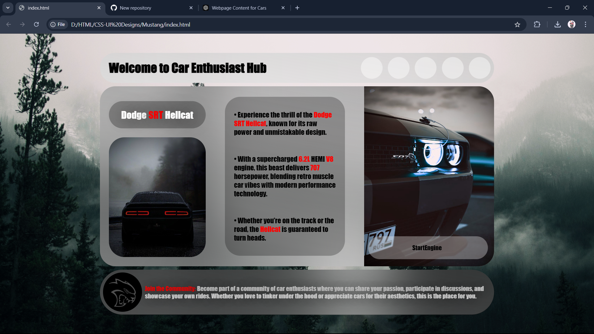

# Car Enthusiast Hub

**Welcome to Car Enthusiast Hub**, a website for car lovers to explore the power, design, and technology behind some of the world's most iconic cars. This project features sleek, modern design elements and a focus on the **Dodge SRT Hellcat**.

## Table of Contents
- [About the Project](#about-the-project)
- [Screenshots](#screenshots)
- [Technologies Used](#technologies-used)
- [Getting Started](#getting-started)
- [Contributing](#contributing)
- [License](#license)

## About the Project

Car Enthusiast Hub is designed to showcase car information, images, and specifications for passionate car enthusiasts. This project currently features the **Dodge SRT Hellcat**, but it can easily be expanded to include other high-performance vehicles.

## Screenshots



## Technologies Used

- **HTML5**: Structure of the web page.
- **CSS3**: Styling for the sleek, modern look.
- **JavaScript**: Interaction and dynamic elements.

## Getting Started

### Prerequisites
- A web browser (Google Chrome, Firefox, etc.)
- Basic knowledge of HTML, CSS, and JavaScript.

### Installation
1. Clone the repo:
   ```bash
   git clone https://github.com/yourusername/car-enthusiast-hub.git
   ```
2. Navigate into the project directory:
   ```bash
   cd car-enthusiast-hub
   ```
3. Open the `index.html` file in your browser:
   ```bash
   open index.html
   ```

## Contributing

Contributions are welcome! To contribute to this project:
1. Fork the repository.
2. Create a new branch (`git checkout -b feature-branch`).
3. Commit your changes (`git commit -m 'Add new feature'`).
4. Push to the branch (`git push origin feature-branch`).
5. Open a Pull Request.

## License

Distributed under the MIT License. See `LICENSE` for more information.

---

You can upload the screenshot you provided and replace the path in the "Screenshots" section with its actual location in your repository.

Let me know if you need any further adjustments or additions!
